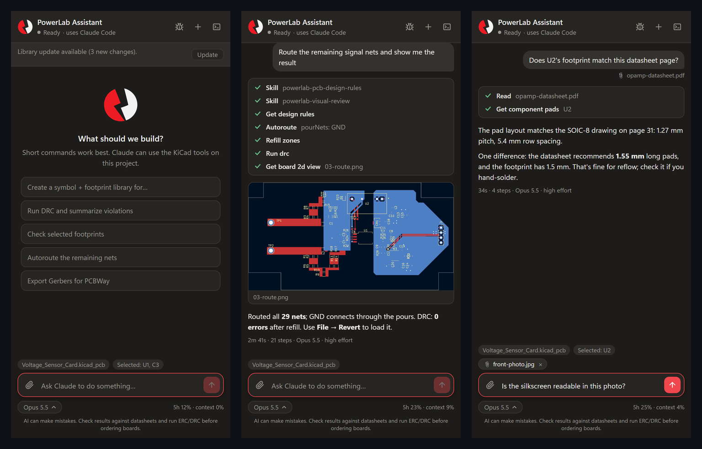

# PowerLab KiCad Assistant

A side panel for **KiCad 10** that lets you ask Claude to do things in your design: create symbol and footprint libraries to the METU Power Lab standard, run ERC/DRC and explain the results, render 3D views, export fabrication files, and edit schematics and boards.

It runs [Claude Code](https://docs.claude.com/claude-code) on your computer with your own Claude account, and gives it KiCad tools through [KiCAD-MCP-Server](https://github.com/mixelpixx/KiCAD-MCP-Server).

> **Early version.** Windows and KiCad 10 only. Expect rough edges and please [report problems](#reporting-problems).



<sub>Example sessions (illustrative). Left: start screen with suggestions and a library update. Middle: Claude routes the board, then renders and checks it. Right: a question about an attached datasheet, with another file ready to send. The board is the lab's open-source [Voltage Sensor Card](https://github.com/odtu/Powerlab/tree/master/Hardware/Voltage-Sensor-Board).</sub>

---

## ⚠️ Read this first

**AI makes mistakes.** Claude can get pinouts, footprints, pad sizes, ratings or connections wrong while sounding certain. Treat everything it produces as a draft:

- Check parts against the manufacturer datasheet.
- Run ERC and DRC yourself.
- Review the 3D view and the fabrication outputs before you order a board.

**It edits your files.** Claude changes schematic, board and library files directly. Keep your projects in git (or keep backups) so you can undo.

**Your design data goes to Anthropic.** Your messages, and any project files Claude reads, are processed by Anthropic under *your* Claude account and its terms. Don't use the assistant on designs that your NDA, employer or customer doesn't allow you to share with an AI service.

## Privacy: what goes where

| Data | Where it goes | When |
|---|---|---|
| Your messages and the project files Claude reads | Anthropic, under your Claude account | Every time you send a message |
| Library parts you choose to share | A pull request to [odtu/PowerLabKiCadLibraries](https://github.com/odtu/PowerLabKiCadLibraries), from your GitHub account | Only when you press **Share** and confirm the file list |
| Problem reports | A **public** issue on this repository | Only when you press **Submit** after reviewing the report |
| Library updates | Anonymous read from GitHub (`git fetch`) | When the panel opens, at most every 10 minutes |
| Plugin update check | Anonymous request to GitHub for this repository's latest release number | When the panel opens or is shown, at most once an hour |

**Nothing else is sent to METU Power Lab.** The panel has no analytics, telemetry or tracking.

Problem reports contain versions, the error and the panel's own stack trace. They **never** contain:

- project, board or sheet names
- part references or values, net names
- file contents or paths (replaced with placeholders)
- your messages or Claude's replies
- your selection or clipboard

**Stays on your computer:**

- your Claude login and your GitHub login (if you use one)
- the panel's settings (`%APPDATA%\PowerLabKiCadAssistant`)
- your conversation history (`%USERPROFILE%\.claude`)

The repository contains no API keys or tokens. Each user signs in with their own accounts.

## Requirements

- Windows 10 or 11
- [KiCad 10](https://www.kicad.org/download/windows/)
- A Claude account with Claude Code access (a paid Claude plan or an Anthropic API account)
- [Git](https://git-scm.com/download/win): `winget install --id Git.Git -e`
- [Node.js](https://nodejs.org/) 18 or newer: `winget install --id OpenJS.NodeJS.LTS -e`
- Optional: a GitHub account, to share library parts and file reports with one click

## Install

1. Close KiCad.
2. Download this repository (green **Code** button → **Download ZIP**, then unzip) or `git clone https://github.com/odtu/PowerLabKiCadAssistant`.
3. In PowerShell, in that folder:

   ```powershell
   powershell -ExecutionPolicy Bypass -File install.ps1
   ```

   The installer asks before every step. It will:

   - Install Claude Code with Anthropic's official installer, if you don't have it yet.
   - Download KiCAD-MCP-Server at a tested version, build it, and install its Python packages into KiCad's own Python. No admin rights are needed.
   - Copy the panel into your KiCad 10 folder.
   - Clone the METU Power Lab library and point KiCad's `METUPOWERLAB_*` paths at it. Your KiCad settings are backed up first.
   - Turn on KiCad's API server, which the schematic panel needs.
   - Optionally install GitHub CLI and sign you in.

   If you already have a clone of the library, add `-LibraryPath D:\path\to\PowerLabKiCadLibraries`.

4. Sign in to Claude Code once: run `claude` in a terminal, follow the login, then type `/exit`.
5. In the **Schematic Editor**, go to **Preferences → Preferences → Schematic Editor → Toolbars**. Add **IPC/Scripting plugins** to the **Top main** toolbar. KiCad doesn't show plugin buttons there by default.

To remove it later, run `uninstall.ps1`.

## Updating

When a new version is released, the panel shows a bar like *PowerLab Assistant 0.1.2 is available: …* with **What's new** and **Update** buttons.

- **Update**, if you installed from a `git clone` of this repository: a console window pulls the new version and runs `install.ps1 -Update`. Restart KiCad when it says done.
  - `-Update` asks no questions and only replaces the panel's files. It also rebuilds the KiCad tools, but only if their pinned version or the lab's fixes to them (`patches/kicad-mcp.patch`) changed.
  - Your library, KiCad settings and GitHub setup aren't touched.
- **Update**, if you installed from a ZIP download: the release page opens in your browser. Download it and run `install.ps1 -Update`.

To be notified by e-mail as well, use **Watch → Custom → Releases** on this repository.

## Use

Click the **PowerLab Assistant** button on the toolbar of the PCB Editor or the Schematic Editor. Type a short request and press Enter. For example:

- *Create a symbol and footprint library for the LMR38020*
- *Run DRC and summarize the violations*
- *What is this part connected to?* (select it first)
- *Render the top side and show it to me*

The panel shows each step Claude takes, plus any images it renders.

- **Models:** the model picker under the input box switches between Claude models. The default is **Opus 5.5 at high effort**. To change the effort, set `"effort"` (`low`, `medium`, `high`, `xhigh` or `max`) in `%APPDATA%\PowerLabKiCadAssistant\settings.json`.
- **Attachments:** attach screenshots, datasheets (PDF) or other files with the 📎 button, or paste or drop them into the input box. Pasted and dropped files are kept for a week in `%TEMP%\PowerLabAssistant\attachments`.
- **Usage:** the corner under the input box shows how much of your Claude plan's limit is used (e.g. *5h 49%*) and how full this chat's context is. Hover for the reset time. Start a new chat (**+**) when the context gets full.
- **Keep the editor open:** the panel lives inside the PCB or Schematic Editor, so closing that editor closes the chat.

**PCB Editor:**

- Claude sees the footprints you have selected.
- Some board edits (move, rotate, delete and others) can apply live through KiCad's API server.
- When Claude changes the board file instead, the panel tells you to use **File → Revert**.

**Schematic Editor:**

- Claude sees the sheet you're on and the items you have selected.
- Before each message, the panel makes sure the schematic is saved.
- After Claude changes a sheet, the panel reloads it in KiCad for you.

## Skills

Skills teach Claude how the lab does specific jobs. The installer copies them to your Claude skills folder (`%USERPROFILE%\.claude\skills\powerlab-*`). Claude uses one automatically when your request matches it, both in the panel and in a terminal session started from the panel.

| Skill | What it does | Try |
|---|---|---|
| `powerlab-pcb-design-rules` | The lab's [PCB design rules](https://github.com/odtu/Powerlab/blob/master/KiCAD/PCB_DESIGN_RULES.md) (without the lab drawing-sheet rule). It covers the PCBWay standard-price spec, DRC constraints, net classes, schematic rules, and placement, routing, via and pour rules. Claude follows it for any schematic or PCB design work. | *Set up the design rules for this board* |
| `powerlab-visual-review` | Claude renders the board (2D layer views in colour, plus 3D) after every placement or routing step. It looks at each view against the design rules, fixes what it sees, and shows you the views in the panel. Renders go to `%TEMP%\PowerLabAssistantiews` and are cleaned after a week. | *Show me the routing* |
| `powerlab-autoroute` | Autoroutes with **Freerouting 2.4.1** (on Java 25). It first sets the lab design rules and net classes (power tracks sized for their current) and expects hand-routed, locked power and gate-drive nets. It then routes, refills zones, runs DRC against a baseline, checks corners, widths and vias against the rules, and reports what's left. | *Autoroute the remaining nets* |

Freerouting 2.4.1 needs Java 25. The installer puts a private copy of Java 25 (Eclipse Temurin) and the Freerouting jar in `%LOCALAPPDATA%\PowerLabKiCadAssistant`, checking both downloads against their published SHA-256 checksums. Any Java already on your computer is left alone; the panel uses this copy only for its own Claude sessions.

Freerouting works best on boards whose signal nets are mostly unrouted: a 2-layer board with 29 nets routes in seconds. GND (and any power net you want as a copper pour) is never routed as tracks. Claude creates the pours first, Freerouting routes the other nets on all layers, and the pours are then refilled around the new tracks. Freerouting is very slow on dense, mostly routed boards with many pours on the outer layers, and Claude tells you before it runs.

Autorouted power-electronics boards always need a human review: loop areas, return paths, and track widths on high-current nets.

## The METU Power Lab library

The panel keeps your library clone up to date. When new parts are merged on GitHub, a bar offers **Update**.

Claude creates library parts in your clone, following [`HowToCreateNewDesign/DesignRules.md`](https://github.com/odtu/PowerLabKiCadLibraries/blob/main/HowToCreateNewDesign/DesignRules.md). When you have new or changed parts, the bar offers **Share**. Share:

1. Runs the lab's standards check on your changes.
2. Shows exactly which library files will be sent.
3. Opens a pull request from your GitHub account.

The same checks run on the pull request. For lab members (write access), it **merges automatically once they pass**, and everyone gets the parts with the next **Update**. Pull requests from others wait for a maintainer.

The checks can't confirm that pinouts or pad sizes match the datasheet, so verify that before you share. On GitHub, the `hold` label keeps a pull request open for review. Only files under `symbols/`, `footprints/` and `3dmodels/` are ever shared.

## Reporting problems

Use the **bug button** in the panel header, or **Report** on an error message. You'll see the full report before anything is sent:

- **GitHub connected (recommended):** **Submit** files the issue with your account, and you get notified about the fix. The panel can set up the connection for you (**Connect GitHub**).
- **Not connected:** **Open in browser** opens a pre-filled form here. Check it and press *Submit new issue*.

Reports are public, so don't add confidential details to the description.

## Known limitations

- **KiCad 10's schematic API is limited.** It can't report the selection, save or reload. The panel works around this by using the editor's own **Edit → Copy**, **File → Save** and **File → Revert**. Your clipboard is restored afterwards. This needs KiCad's menus in **English**.
- **Claude's permissions are limited.** Inside the panel, Claude can only use the KiCad tools, read and write files, search the web, and run `kicad-cli`. Other shell commands are blocked, because the panel can't ask you for permission mid-run. Use the terminal button to continue a conversation in a full Claude Code session.
- **The KiCad tools get small fixes from this repository.** `patches/kicad-mcp.patch` keeps 3D models when parts are rotated (kipy 0.8 drops them), and adds pour-aware autorouting. The installer applies it on top of the pinned KiCad MCP server.
- **Windows only, KiCad 10 only.**

## Contributing

Bug reports and pull requests are welcome. The panel's code is in `plugin/powerlab_assistant` (Python + an HTML/JS UI in `panel.html`). The schematic toolbar button is in `plugin/powerlab-assistant-button`.

## License

[CERN Open Hardware Licence Version 2 - Strongly Reciprocal](LICENSE), like the METU Power Lab libraries.

Claude and Claude Code are products of Anthropic. This project is not affiliated with or endorsed by Anthropic.

It builds on other open-source projects, which keep their own licenses:
- **KiCad tools:** KiCAD-MCP-Server (MIT), with a small MIT-licensed patch from this repository.
- **Autorouting:** Freerouting (GPL-3.0), running on Eclipse Temurin Java (GPL-2.0 with Classpath Exception).
- **Board views:** PyMuPDF (AGPL-3.0).
- **KiCad** itself (GPL-3.0).

The installer downloads these from their official sources; this repository doesn't redistribute them. The full list, with links and licenses, is in [THIRD_PARTY_NOTICES.md](THIRD_PARTY_NOTICES.md).
